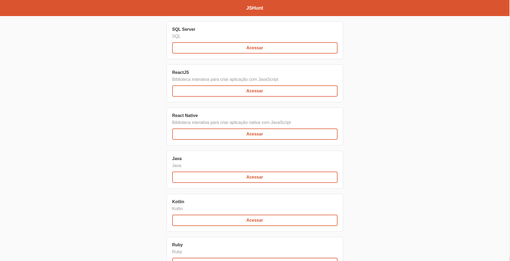
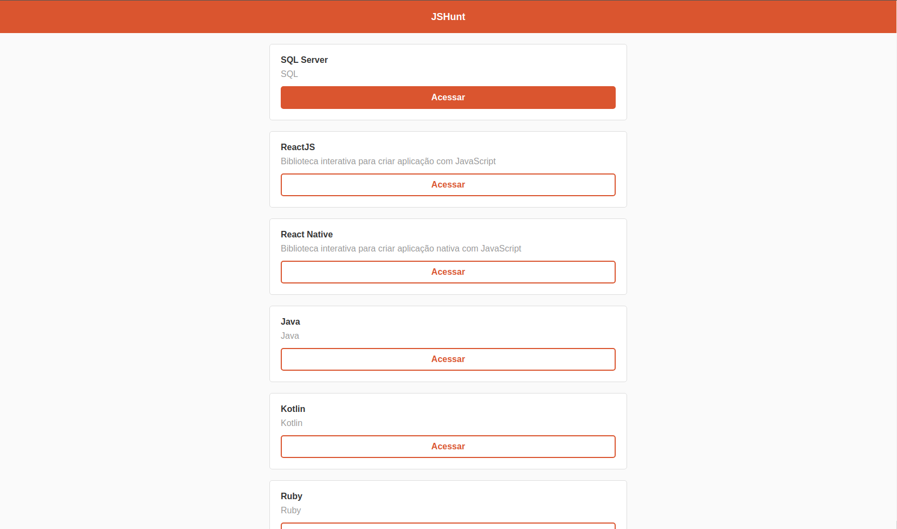
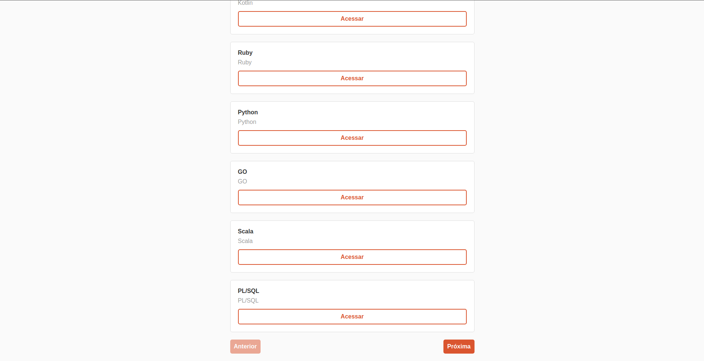
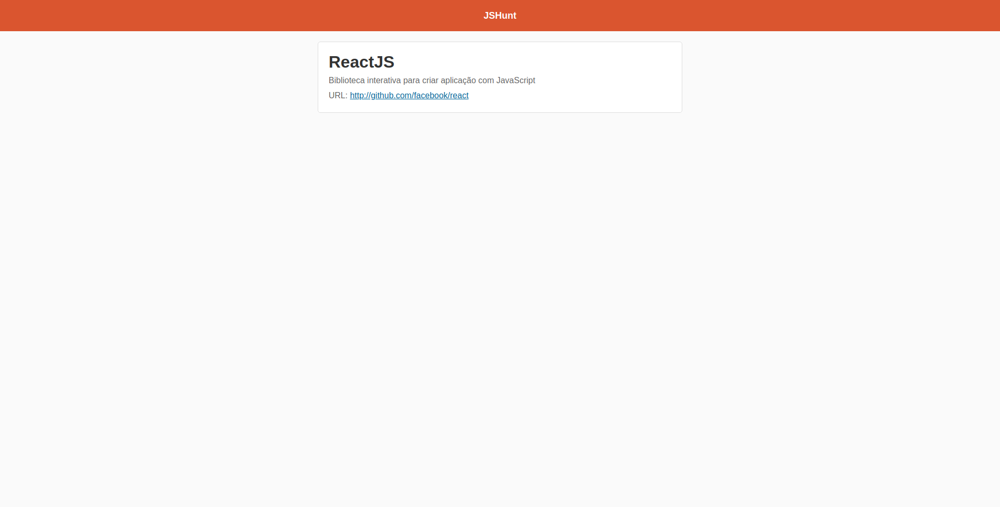

<h1 align="center">
Hunt Web
</h1>

<p align="center">
  
  
  
  
</p>

<p align="center">
  <a href="#sobre">Sobre</a> •
  <a href="#HuntWeb">HuntWeb</a> •
  <a href="#instalação">Instalação</a> •
  <a href="#tecnologias">Tecnologias</a> •
  <a href="#autor">Autor</a>  
</p>

<br><br><br>

## Sobre

<p align="justify">
 Projeto desenvolvido com o intuito de obter conhecimento básico no React.
 HuntWeb é uma aplicação feita em <strong>ReactJS</strong> para listagem de produtos. A aplicação consome uma <strong>API REST</strong> desenvolvida com <strong>NodeJS</strong>.</p>

#### :computer: Com este projeto coloquei em prática:

- [x] Componentização.
- [x] Estados do React.
- [x] Paginação.
- [x] Consumo de API's com o React.
- [x] Roteamento da aplicação.

<br>

## HuntWeb

O aplicativo HuntWeb consiste em uma aplicação para cadastro e listagem de produtos.
Esse repositório contém a versão web do projeto que possui duas telas, onde:

### Home:

É onde os produtos cadastrados no banco são exibidos. A tela é responsiva e possui botões de navegação que são habilitados com base na quantidades de produtos cadastrados.



<br>


<br>


### Produto:

É onde os detalhes de um produto é exibido. A tela é aberta ao clicar no botão **Acessar** presente na listagem da tela **Home**



## Instalação

Antes de começar, você vai precisar ter instalado em sua máquina as seguintes ferramentas:
[Git](https://git-scm.com), [Node.js](https://nodejs.org/en/).
Além disto é bom ter um editor para trabalhar com o código, como [VSCode](https://code.visualstudio.com/)

### 📱 Rodando o App

```bash
# Clone este repositório
$ git clone git@github.com:MrRioja/HuntWeb.git

# Acesse a pasta do projeto no terminal/cmd
$ cd HuntWeb

# Instale as dependências
$ npm install
# Caso prefira usar o Yarn execute o comando abaixo
$ yarn

# Execute a aplicação
$ yarn start

# A aplicação será aberta no endereço http://localhost:3000/.
# Para que a listagem funcione é necessário que o backend esteja em execução.
```

### 🎲 Rodando o Back End (servidor)

```bash
# Clone este repositório
$ git clone git@github.com:MrRioja/Node-API.git

# Acesse a pasta do projeto no terminal/cmd
$ cd Node-API

# Instale as dependências
$ npm install
# Caso prefira usar o Yarn execute o comando abaixo
$ yarn

# Execute a aplicação em modo de desenvolvimento
$ npm run dev
# Caso prefira usar o Yarn execute o comando abaixo
$ yarn dev

# O servidor inciará na porta 3001 ou na porta definida no arquivo .env na variável APP_PORT - acesse <http://localhost:3001>
```

## Tecnologias


<br><br><br><br><br><br>

## Autor

<div align="center">

<h1>Luiz Rioja</h1>
<strong>Backend Developer</strong>
<br/>
<br/>

<a href="https://linkedin.com/in/luizrioja" target="_blank">

</a>

<a href="https://github.com/mrrioja" target="_blank">

</a>

<a href="mailto:lulyrioja@gmail.com?subject=Fala%20Dev" target="_blank">

</a>

<a href="https://api.whatsapp.com/send?phone=5511933572652" target="_blank">

</a>

<a href="https://join.skype.com/invite/tvBbOq03j5Uu" target="_blank">

</a>

<br/>
<br/>
</div>
